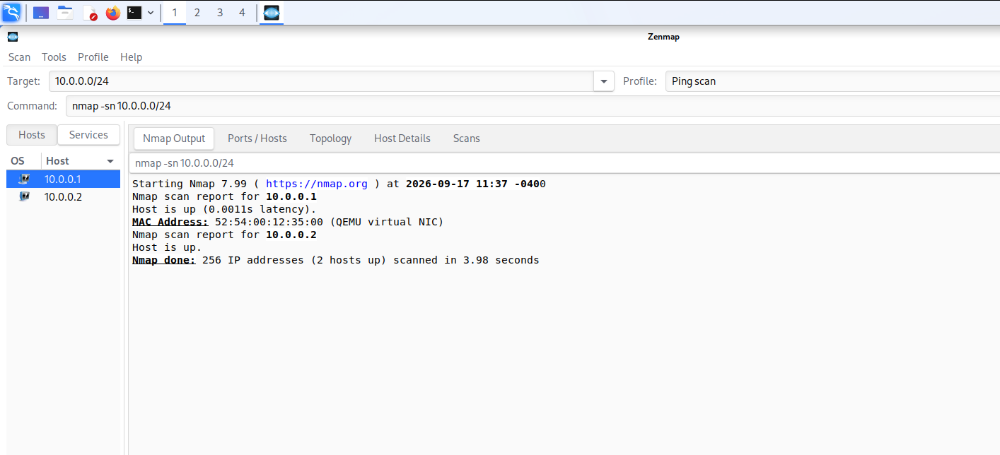
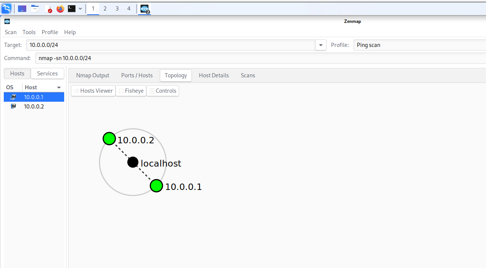
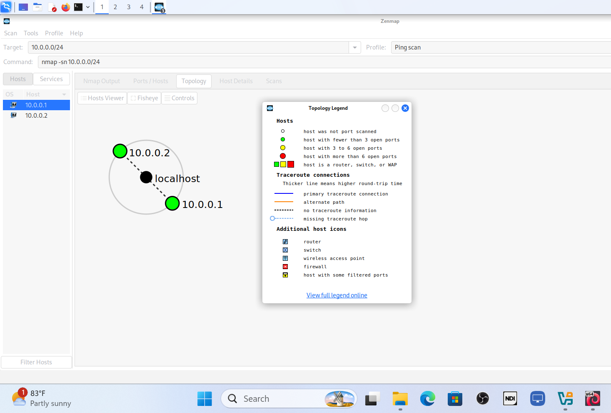
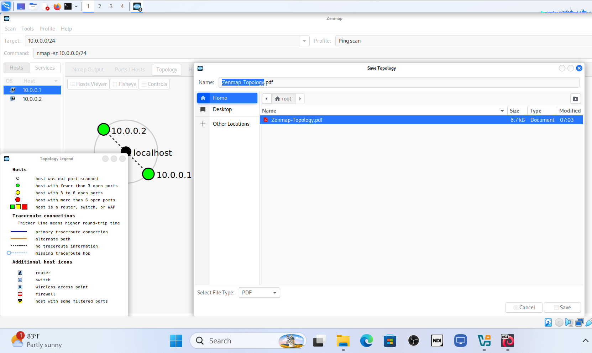

# 🔎 Network Scanning with Zenmap


## 📌 Project Overview

This project demonstrates a **network discovery and reconnaissance exercise using Zenmap**, the graphical interface for Nmap.

The exercise involved performing a host discovery scan, identifying active hosts, visualizing the discovered network, interpreting the topology, and saving the resulting visualization.

**Target Network:** `10.0.0.0/24`

---

## 🎯 Objectives

* Perform network host discovery using Zenmap.
* Identify active hosts on the target subnet.
* Visualize the discovered network topology.
* Interpret the topology using Zenmap's legend.
* Save the resulting network visualization.
* Document the practical reconnaissance process.

---

## 🛠️ Tools Used

* **Zenmap**
* **Nmap**

---

## 🔎 1. Network Scanning

### What I Did

I configured Zenmap to perform a **Ping Scan** against the target network.

The scan used:

```bash
nmap -sn 10.0.0.0/24
```

The scan successfully identified **2 live hosts**:

| IP Address | Status |
| ---------- | ------ |
| `10.0.0.1` | Live   |
| `10.0.0.2` | Live   |

The `10.0.0.1` host was identified as using a **QEMU virtual NIC**.

### 📸 Evidence 1 — Network Scanning



---

## 🗺️ 2. Network Topology

### What I Did

After completing the host discovery scan, I opened Zenmap's **Topology** tab to visualize the discovered hosts and their network relationships.

### 📸 Evidence 2 — Network Topology



---

## 🗺️ 3. Topology Legend

### What I Did

I enabled the **Legend** in Zenmap's Topology view to help interpret the symbols and indicators displayed in the network visualization.

### 📸 Evidence 3 — Topology Legend



---

## 💾 4. Saving the Topology

### What I Did

After reviewing the topology, I used Zenmap's **Save Graphic** function to save the completed network visualization.

The topology was exported as:

**`Zenmap-Topology.pdf`**

### 📸 Evidence 4 — Saving the Topology



### 📄 Exported File

[**View Zenmap-Topology.pdf**](Zenmap-Topology.pdf)

---

## 📊 Results

| Activity               | Result                |
| ---------------------- | --------------------- |
| Target network         | `10.0.0.0/24`         |
| Host discovery         | Completed             |
| Live hosts discovered  | 2                     |
| Topology visualization | Completed             |
| Topology legend        | Enabled               |
| Topology export        | `Zenmap-Topology.pdf` |

---

## 🧠 Skills Demonstrated

* Network reconnaissance
* Host discovery
* Nmap / Zenmap
* IP addressing and CIDR
* Network analysis
* Network topology visualization
* Technical documentation

---

## 💡 Key Takeaways

This exercise provided practical experience with **network discovery and topology visualization using Zenmap**.

I learned how to:

* Perform host discovery against a subnet.
* Use Nmap's `-sn` option to identify live hosts.
* Interpret Zenmap scan results.
* Visualize discovered hosts using the Topology feature.
* Use the topology legend to understand network indicators.
* Save and document the resulting network visualization.

---

## 📚 References

* [Nmap Official Documentation](https://nmap.org/book/man.html)
* [NetworkWalks — Zenmap Network Scanning Practice Lab](https://networkwalks.com/zenmap-network-scanning-practice-lab/)

---

## ⚠️ Ethical Use

This exercise was performed in a controlled learning environment for cybersecurity education.

Network scanning should only be performed against systems and networks that you own or have explicit authorization to test.
